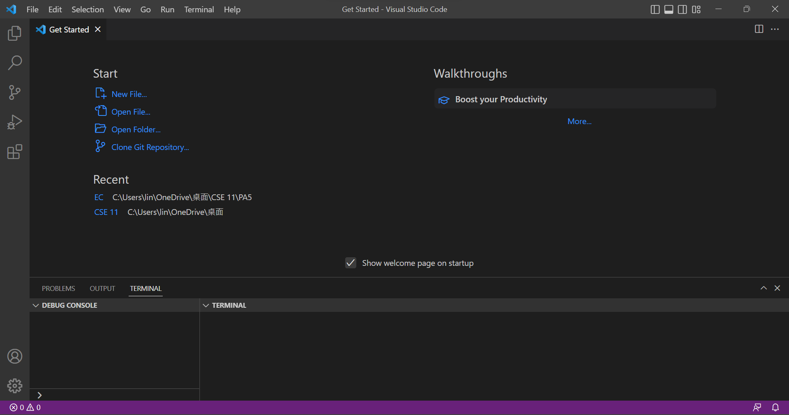
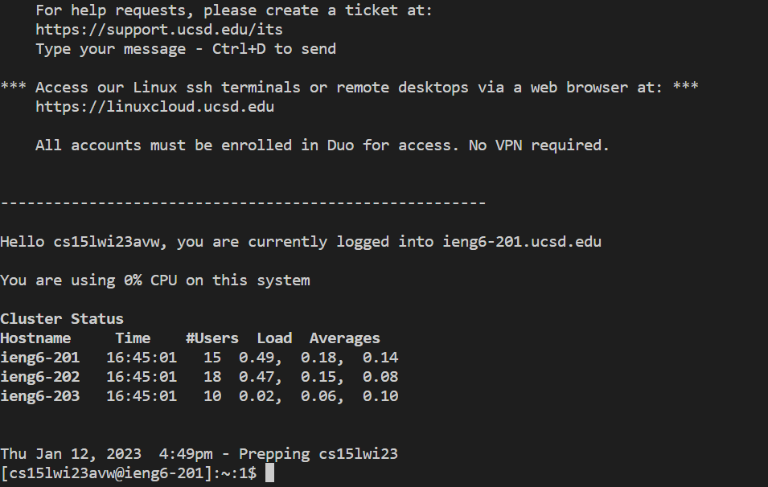
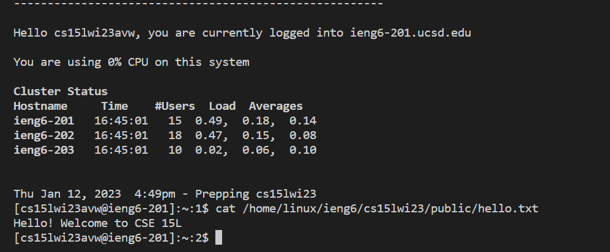

# Week 1 Lab Report
This tutorial is about logging into a course-spefic accound on `ieng6`.

It includes 3 main parts:
* [Installing VScode](#installing-vscode)
* [Remotely Connecting](#remotely-connecting)
* [Trying Some Commands](#trying-some-commands)

## Installing VScode
* Download [VScode](https://code.visualstudio.com/)
* There are different versions for different operating system

## Remotely Connecting
### Course-Specific Account
* Find your [account](https://sdacs.ucsd.edu/~icc/index.php) and reset the password
* Your username will look like `cs15lwi23zz` (zz is your unique username)
### Use ssh
* Open a terminal in VScode
* Run `ssh cs15lwi23zz@ieng6.ucsd.edu` (replace zz with your real username)
* You  will get a message: `Are you sure you want continue?`
* Type `yes`
* Type your password

## Trying Some Commands
* Commands that you can try: `cd~`, `cd`, `ls - lat`, `ls -a`, `ls </home/linux/ieng6/<other group members' username>`, `cp /home/ linux/ieng6/cs15lwi23/public/hello.txt ~/`, `cat /home/linux/ieng6/cs15lwi23/public/hello.txt` 
* Below is an example of trying `cat /home/linux/ieng6/cs15lwi23/public/hello.txt`
* It prints out the content of `hello.txt`

* If you want to log out of the remote server, run the command `exit` or `Ctrl + D`
