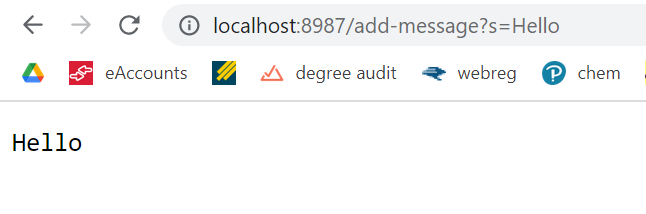
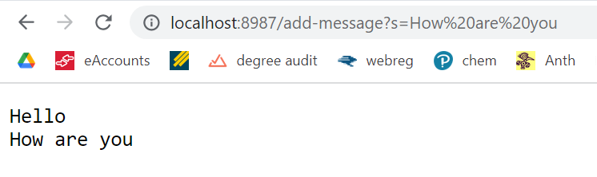
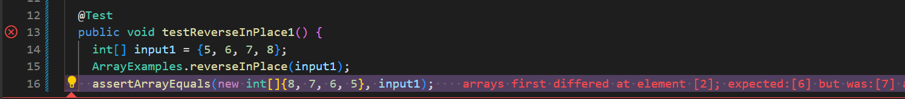
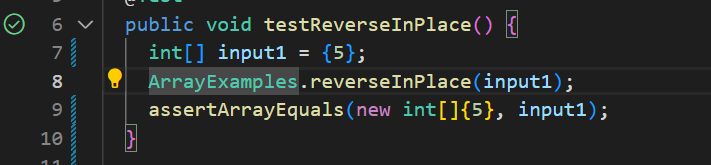

# Week 4 Lab Report 2
## Part 1
### StringServer
```js
import java.io.IOException;
import java.net.URI;
import java.util.*;
class Handler implements URLHandler {
    int num = 0;
    ArrayList<String> stringAll = new ArrayList<>();
    String keepTrack = "";
    public String handleRequest(URI url) {
      if (url.getPath().equals("/")) {
          return String.format(keepTrack);
      } else {
          System.out.println("Path: " + url.getPath());
          if (url.getPath().contains("/add-message")) {
              String[] parameters = url.getQuery().split("=");
              if (parameters[0].equals("s")) {
                keepTrack += String.format("%s\n", parameters[1]);
                return String.format(keepTrack);
              }
          }
          return "404 Not Found!";
      }
    } 
}

class StringServer {
    public static void main(String[] args) throws IOException {
        if(args.length == 0){
            System.out.println("Missing port number! Try any number between 1024 to 49151");
            return;
        }

        int port = Integer.parseInt(args[0]);

        Server.start(port, new Handler());
    }
}
```
### `Hello`:
* String `handleRequest(URI url)` is called.
* The parameter `URI url` here is `http://localhost:8987/add-message?s=hello`.
* `handleRequest(URI url)` will get the path of the `URI url`, which is the things after the port number `8987`.
* When the path is `add-message`, what I type after `?s=` will be concatenated to `String keepTrack`. `Hello` is now concatenated to `keepTrack`.
* The value of `keepTrack` is changed, and it is now

```
Hello
```



### `How are you`:
* String `handleRequest(URI url)` is called.
* * The parameter `URI url` here is `http://localhost:8987/add-message?s=How are you`.
* `handleRequest(URI url)` will get the path of the `URI url`, which is the things after the port number `8987`.
* When the path is `add-message`, what I type after `?s=` will be concatenated to `String keepTrack`. `How are you` is now concatenated to `keepTrack`.
* The value of `keepTrack` is changed, and it is now

```
Hello
How are you
```



## Part 2
### bug:`reverseInPlace()`

#### failure inducing input: `{5, 6, 7, 8}`
```js
@Test 
public void testReverseInPlace1() {
  int[] input1 = {5, 6, 7, 8};
  ArrayExamples.reverseInPlace(input1);
  assertArrayEquals(new int[]{8, 7, 6, 5}, input1);
}
```
#### input that doesn't induce a failure: `{5}`
```js
@Test 
public void testReverseInPlace1() {
  int[] input1 = {5};
  ArrayExamples.reverseInPlace(input1);
  assertArrayEquals(new int[]{5}, input1);
}
 ```

#### Symptoms:

failure inducing input: `{5, 6, 7, 8}`



input that doesn't induce a failure: `{5}`



#### Before and After:
Before:
```
  static void reverseInPlace(int[] arr) {
    for(int i = 0; i < arr.length; i += 1) {
      arr[i] = arr[arr.length - i - 1];
    }
  }
```
After:
```
  static void reverseInPlace(int[] arr) {
    int[] newArray = new int[arr.length]; 
    for(int i = 0; i < arr.length; i += 1) {
      newArray[i] = arr[arr.length - i - 1];
    }
    arr = newArray;
  }
  ```
The code that has bug is letting `arr` storing a new reversed array and accessing the old `arr` at the same time. To fix the problem, I created a new array, `newArray`, to store the elements of the reversed `arr`. After the reversed array is stored in `newArray`, `arr` can be the same as the reversed array by `arr = newArray`.
 
## Part 3
Before this week's lab, I have no idea what JUnit was. I always thought I need to have a main method and test my program in the main method. Now that I learned about JUnit, testings are more efficient.
