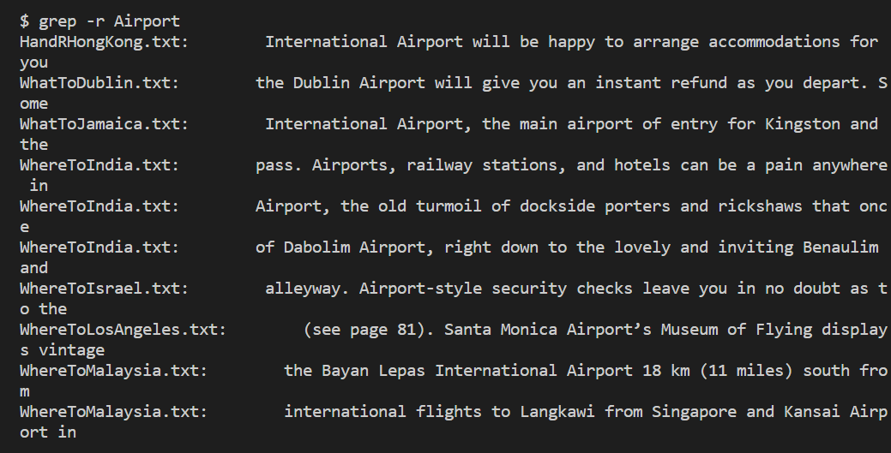

# Week 4 Lab Report 2
1. `grep pattern file`
```
This command will grep the file that has the word that you type for pattern.
The specific pattern here is Honolulu, and the file is HandRHawaii.txt.

```
```
This command will grep the file that has the word that you type for pattern.
The specific pattern here is hotel, and the file is HandRHongKong.txt.

```
2.`grep -r pattern`
```
This command will grep all the files in the directory that has the word that you type for pattern.
The specific pattern here is Airport, and it is in the directory `berlitz1`.

```
```
This command will grep all the files in the directory that has the word that you type for pattern.
The specific pattern here is Museum, and it is in the directory `berlitz1`.

```
