# Week 7 Lab Report 4
## 4. Log into ieng6
keys pressed: `Ctrl-R avw <enter>`

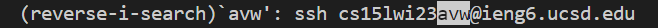
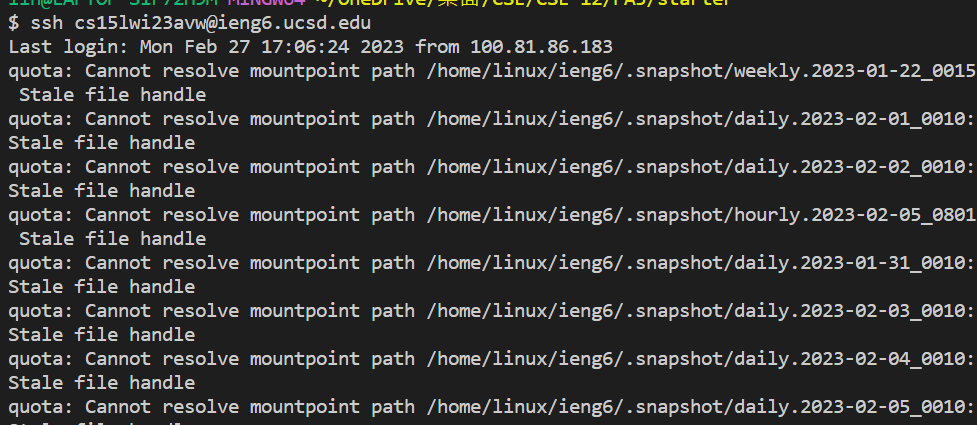

## 5. Clone your fork of the repository from your Github account
keys pressed: `Ctrl-R git <enter>`

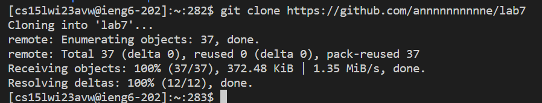
## 6. Run the tests, demonstrating that they fail
keys pressed: `cd lab7`, `<up><up><up><up><enter>`, `<up><up><up><up><up><up><enter>`
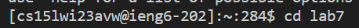
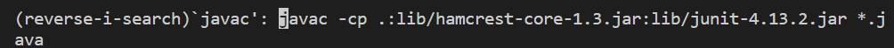
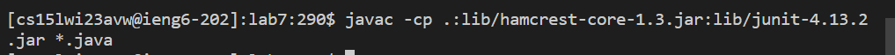
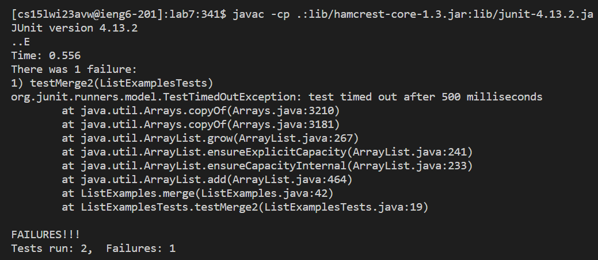

## 7. Edit the code file to fix the failing test
keys pressed: `nano ja<tab> .java <enter>`, `Ctrl-W list2.size <down> <down> <left> <left> <left> <left> <left> <left> <backspace> 2`, `Ctrl-O`, `Ctrl-X`

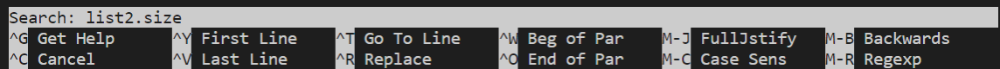
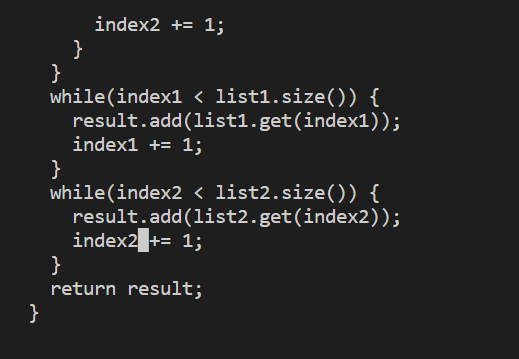

## 8. Run the tests, demonstrating that they now succeed
keys pressed:`<up><up><up><up><enter>`, `<up><up><up><up><up><up><enter>`
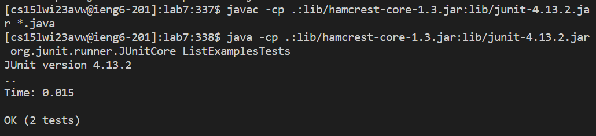

## 9. Commit and push the resulting change to your Github account
keys pressed: `git add ListExamples.java <enter>`, `git commit -m "bugs fixed"`, `git push origin main`
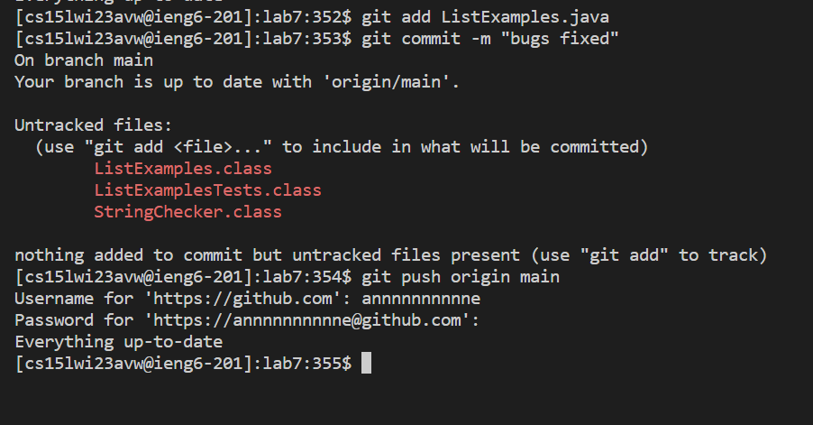

